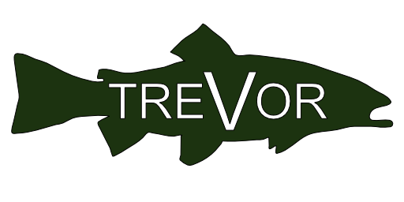

<!-- PROJECT LOGO -->
 

  

  <h3 align="center">Trevor</h3>

  

    A Discord bot framework, written in go.
     
    <a href="https://github.com/fishykins/trevor/">Documentation</a>
    ·
    <a href="https://discord.com/developers/docs/intro">Discord</a>
    ·
    <a href="https://go.dev/">Golang</a>

  

## About The Project
Trevor was born into this world as a simple bot with the *sole* purpose of dishing out insults. He has since grown into a *scale*able framework for discord bots, all while hosting his own selection of bizare modules. 

## Quirks
As this repo makes extensive use of slash commands, it requires a local install of [Discordgo](https://github.com/bwmarrin/discordgo), as this feature is not yet released. Expect breaking changes!

## Application Flow
The application is broken down into three key stages:
1. **Init** builds the basic application.
2. **Start** connects the application to Discord and opens any required database connections.
3. **Ready** is called once discord has given us the all clear.
4. **Stop** handles shutdown procedures, such as closing connections and ensuring configs are up to date.

Modules can be allocated eventHandlers to execute on each stage, baring **Start**, which is exclusive to the core app.
The flow is managed by the end user via **Application** calls.